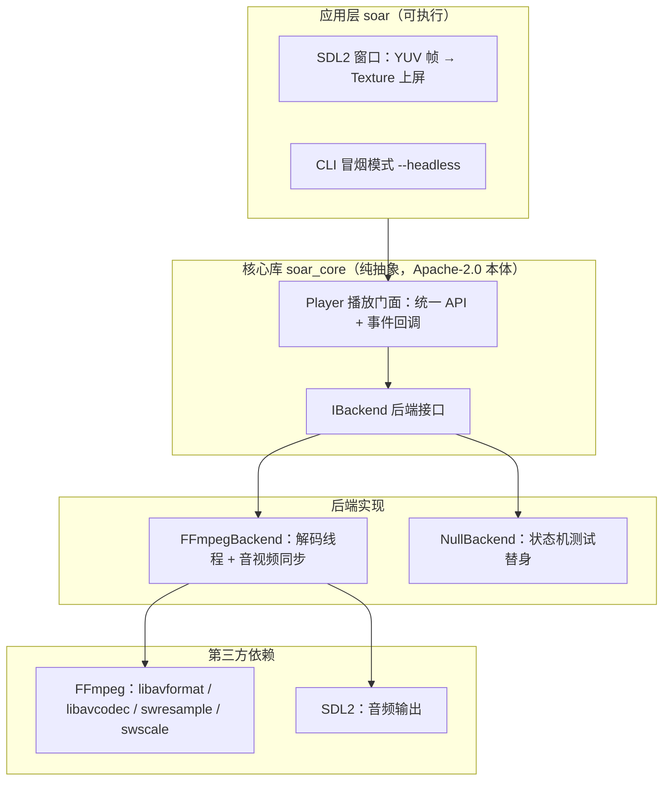

# Soar — Universal Media Player

> **万般格式，任其翱翔。**
> Soar 是一个用 C++17 从零打造的万能格式开源播放器：一套干净的核心播放抽象（Playback Abstraction），配上 FFmpeg 后端，把"能想到的格式都放得出来"作为长期目标。

[](https://github.com/cuihairu/soar/actions/workflows/ci.yml)

## 为什么做 Soar

我们过去在播放器项目里反复踩同样的坑：播放内核和 UI 纠缠不清、依赖许可证（License）把分发卡死、想在移动端复用时发现核心早已绑死某个平台框架。Soar 是我们把这些经验沉淀成的一个答案——

- **核心只有一份**：播放 API 与事件模型不依赖任何具体多媒体库；
- **后端可插拔**：FFmpeg、系统框架、还是测试用的假后端，都实现同一个 `IBackend` 接口；
- **合规先行**：项目本体保持 Apache-2.0，依赖选型守住 LGPL/GPL 边界（见 [docs/licensing.md](docs/licensing.md)）。

## 当前状态

项目处于 MVP（v0.1）早期阶段：核心播放链路（打开 → 解码 → 音视频同步 → 渲染/出声）已经在 FFmpeg + SDL2 后端上跑通，CLI 冒烟入口和 SDL2 窗口可用；播放中/暂停中的音频轨运行时切换也已落地（解码线程在安全点无感换轨并回跳到当前进度续播）。字幕渲染、播放列表等仍在路线图上（见下文 roadmap），欢迎按 [docs/mvp.md](docs/mvp.md) 的边界一起推进。

## 功能特性（当前已实现）

- **媒体输入**：本地文件与网络流 URL（`http(s)` 等 FFmpeg 支持的一切协议），打开失败时错误原因可见；
- **播放控制**：播放 / 暂停 / 停止 / Seek（跳转）/ 倍速（Rate）/ 音量与静音；
- **媒体信息**：时长、是否可 Seek、轨道（Track）列表（视频 / 音频 / 字幕，含编码、语言、标题）；
- **轨道选择**：音频轨运行时切换（播放中/暂停中无感续播，字幕轨为元数据记录，字幕渲染尚未实现）；
- **事件驱动**：状态变化、进度更新、媒体信息变化、错误四类事件，UI 只需订阅回调；
- **视频渲染**：后端解码为 YUV420P 帧并导出，应用层用 SDL2 Texture 直接上屏；
- **音频输出**：SDL2 音频设备，重采样（Resample）到设备参数，支持音量/静音/倍速。

## 架构



设计要点（也是我们踩坑后的取舍）：

- **解封装（Demux）与解码（Decode）在独立线程**：播放线程不被 IO 阻塞，暂停/Seek 通过条件变量（Condition Variable）与原子量（Atomic）通知解码循环；
- **时钟与同步**：以 PTS（Presentation Timestamp，显示时间戳）为基准，结合播放倍速换算墙钟时间，视频按点到点呈现，音频走设备队列并用背压（Backpressure）限流；
- **测试替身内置**：`NullBackend` 用纯状态机模拟完整播放行为，不依赖任何多媒体库，让核心 API 的单元测试可以在任何 CI 环境运行。

## 构建

前置：CMake 3.20+、C++17 编译器、Ninja（推荐）、[vcpkg](https://github.com/microsoft/vcpkg)。

```bash
export VCPKG_ROOT=/path/to/vcpkg   # Windows PowerShell: $env:VCPKG_ROOT="C:\path\to\vcpkg"
cmake --preset default && cmake --build --preset default   # Debug
# 或：cmake --preset release && cmake --build --preset release
```

可选能力自动探测：找到 FFmpeg（pkg-config）则启用 FFmpeg 后端，找到 SDL2 则启用窗口渲染与音频输出；都找不到时仍可构建纯核心 + CLI（Null 后端）。细节见 [docs/build.md](docs/build.md)。

## 使用

```bash
# SDL2 窗口播放（编译包含 FFmpeg 后端时）
./build/soar --backend=ffmpeg <path-or-url>

# CLI 冒烟测试（不开窗口：打开 → 播放 → Seek → 暂停 → 停止）
./build/soar --headless --backend=ffmpeg <path-or-url>

# 无多媒体依赖的核心行为演示
./build/soar --backend=null <path-or-url>
```

## 路线图

- **v0.1（MVP，进行中）**：播放控制、Seek、倍速、音量、轨道信息与选择、事件与进度回调；
- **v0.2**：播放列表、截图、A-B 循环、音频设备选择、HLS/DASH/RTSP、字幕体验（字体/大小/同步偏移）；
- **v1.0**：硬解（Hardware Decoding）与 HDR、投屏（AirPlay/Chromecast/DLNA）、媒体库与刮削、插件体系。

完整边界与"明确不做"清单见 [docs/mvp.md](docs/mvp.md)。

## 测试

测试基于 CTest 运行：

```bash
ctest --preset default
```

各套件的分工：

| 套件 | 覆盖内容 | 依赖 |
|---|---|---|
| `soar_core_tests` | 核心 API 与播放器状态机 | 无，以 `NullBackend` 为测试替身 |
| `soar_backend_tests` | FFmpeg 后端并发行为（线程交接、竞态） | 无 FFmpeg 时构建为空壳并跳过 |
| `soar_backend_media_tests` | FFmpeg 后端真实媒体语义（轨道、seek、EOF、事件） | 需先运行 fixture 脚本 |
| `soar_cli_tests` | `soar --headless` 子进程冒烟（退出码与报错路径） | 仅当应用目标被构建时注册 |

FFmpeg 媒体测试的媒体文件全部由 `scripts/generate_test_media.sh` 现场合成（纯 lavfi，无网络、无外部素材），脚本打印 `KEY=VALUE` 形式的环境变量供测试定位文件：

```bash
export $(bash scripts/generate_test_media.sh build-system/testmedia)
ctest --preset linux-system   # FFmpeg 后端需要系统 FFmpeg 开发库
```

环境变量未设置时相关用例自动跳过，因此没有媒体 fixture 的平台（如 macOS/Windows CI）套件依然全绿。行覆盖率与分支覆盖率由 CI 的 coverage job（gcovr，过滤异常处理边与内联噪声）统计，报告输出到该 job 的 summary，并可在构建产物 `coverage-report` 中下载；该 job 同时是回归门禁——覆盖率跌破锁定阈值（`--fail-under-line` / `--fail-under-branch`）时直接失败。统计口径与未覆盖项的如实定性（版本依赖行为、防御性代码、结构性不可达）见 [docs/coverage-notes.md](docs/coverage-notes.md)。

## 许可与合规

- 项目本体以 [Apache-2.0](LICENSE) 分发；
- FFmpeg 以 LGPL 构建方式动态链接，我们不分发任何 GPL 组件；集成第三方多媒体库的选型原则与 LGPL 合规清单见 [docs/licensing.md](docs/licensing.md)；
- 发行包需附 [THIRD_PARTY_NOTICES.md](THIRD_PARTY_NOTICES.md) 并按其中模板补齐实际捆绑的组件清单。
