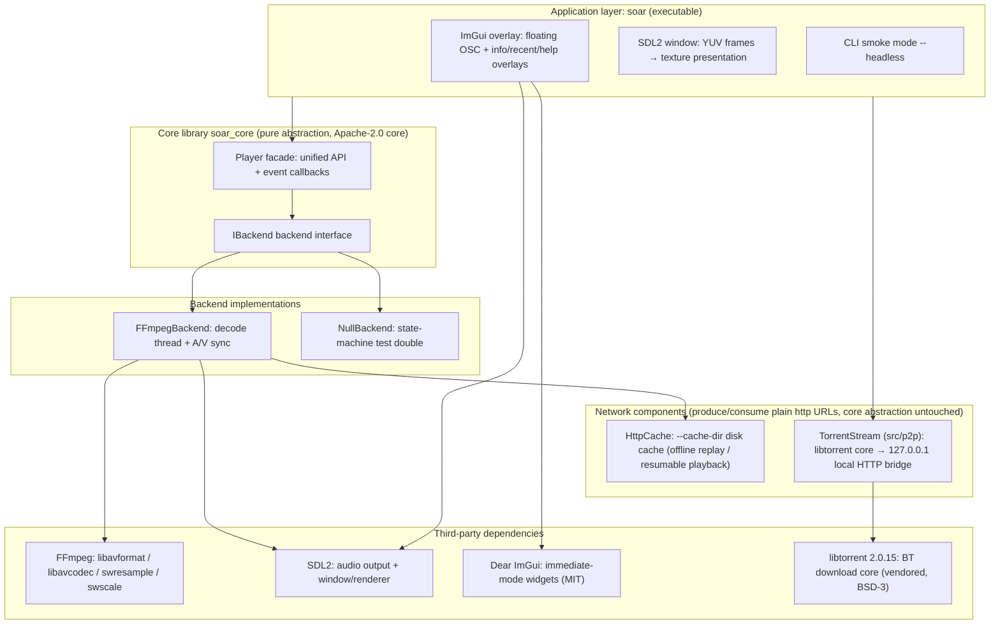

<div align="center">

[English](README.md) | [中文](README.zh.md)


# Soar — Universal Media Player

**Every format, set free.**

Soar is an open-source C++17 media player built on FFmpeg + SDL2: it wraps a core playback abstraction plus a desktop UI, delegates demuxing and decoding to FFmpeg, and treats "playing every format you can think of" as a long-term goal.

[](https://github.com/cuihairu/soar/actions/workflows/ci.yml)
[](https://en.cppreference.com/w/cpp/17)
[](LICENSE)
[](https://github.com/cuihairu/soar/actions/workflows/ci.yml)
[](https://cmake.org)
[](https://ffmpeg.org)
[](https://wiki.libsdl.org)

[Docs](https://github.com/cuihairu/soar/tree/main/docs) · [Build guide](docs/build.md) · [Roadmap](docs/mvp.md)

</div>

## Why Soar

We kept hitting the same pitfalls in past player projects: playback cores entangled with UI, dependency licenses blocking distribution, and a core locked to one platform framework just when we wanted to reuse it on mobile. Soar turns these three lessons into design constraints.

The playback API and event model depend on no specific multimedia library — swap the UI, keep the core. Backends are pluggable: FFmpeg, system frameworks, and fake backends for testing all implement the same `IBackend` interface. The project itself is Apache-2.0, and dependency choices respect the LGPL/GPL boundary (see [docs/licensing.md](docs/licensing.md)).

## Current status

The v0.1 core playback pipeline (open → decode → A/V sync → render/audio) runs end to end on the FFmpeg + SDL2 backend, with a CLI smoke entry point; all v0.2 capabilities have landed (playlist, screenshots, A-B loop, audio endpoint switching, HLS/DASH/RTSP smoke coverage, subtitle rendering and subtitle experience, stream-while-downloading and P2P download — see the roadmap below and [docs/mvp.md](docs/mvp.md)). The desktop app is an SDL2 window with a Dear ImGui overlay floating control bar (OSC), plus keyboard shortcuts and info/recent/help/playlist overlays (design and trade-offs in [docs/ui-design.md](docs/ui-design.md)); audio and subtitle tracks can be switched at runtime, during playback or while paused, without interrupting playback (details below and docs/mvp.md §6). v1.0 (hardware decoding/HDR, casting, media library) has not started.

## Features (implemented)

- **Media input**: local files, multiple files queued (`soar <a> <b> …` — the first plays, the rest queue), network stream URLs (`http(s)`/HLS/DASH/RTSP and every other protocol FFmpeg supports), `.torrent` files and `magnet:` links; failure reasons are visible when opening fails;
- **Playback control**: play / pause / stop / seek / rate / volume and mute;
- **Playlist**: `N`/`Shift+N` for next/previous (out-of-range shows a Toast instead of wrapping), auto-advance on natural end (stops at Ended on the last item; Space replays), `P` overlay with click-to-play and `x` to remove, Loop three-state (off/all/one) and Shuffle;
- **Screenshots and A-B loop**: `S` saves the most recently presented frame as `screenshot.png`; `L` sets a three-step loop (set A → set B → clear, jumps back at EOF, cleared by a manual seek);
- **Media info**: duration, seekability, track list (video / audio / subtitle, with codec, language, title);
- **Track selection**: audio track switching at runtime (seamless while playing or paused); video track switching not supported; subtitle track switching at runtime — selecting a built-in track swaps the subtitle decoder at a safe point in the decode thread and resumes cues from the new track (historical cues before the switch point need one backward seek to rescan; no automatic rescan), selecting an external track or turning subtitles off closes the built-in subtitle decode gate (details and boundaries in [docs/mvp.md](docs/mvp.md) §6);
- **Subtitle rendering**: built-in ASS/SSA rendered with [libass](https://github.com/libass/libass) styling (fonts/colors/positioning/effects follow the script; container-attached fonts are used as-is), external .ass/.ssa rendered with the same styling, external SRT/WebVTT rendered on the same canvas with the repository default style (builds without libass degrade to plain text), built-in SRT/WebVTT text subtitles extracted and displayed in real time; `V` toggles visibility, `[`/`]` ±0.5s sync offset, subtitle settings overlay (font size / sync offset / visibility); optional subtitle download (`SOAR_SUBTITLE_ENDPOINT`/`_API_KEY`) and subtitle translation (`SOAR_TRANSLATE_ENDPOINT` etc., OpenAI-compatible endpoint) services — zero network by default, no request is made unless configured (see docs/mvp.md §6);
- **Event-driven**: four event categories — state changes, progress updates, media info changes, errors — the UI only subscribes to callbacks;
- **Video rendering**: the backend decodes to YUV420P frames and exports them; the application layer presents them directly as SDL2 textures;
- **Audio output**: SDL2 audio device, resampled to device parameters, with volume/mute/rate support; output endpoints can be enumerated and switched in the audio track menu (takes effect on the next audio frame);
- **Network and download**: HTTP(S) plays as it downloads; `--cache-dir=` enables disk caching — the same URL replays offline, playback resumes after interruption, and seeking into an undownloaded range fetches only the target blocks, with a `Downloading N%` progress badge (http:// goes through the cache, https passes through; see docs/mvp.md §5 P3); `.torrent`/`magnet:` download sequentially via a vendored libtorrent core, bridged into the same playback pipeline as a local `http://127.0.0.1:<port>/` URL (`--torrent-store=`/`--torrent-peer=`/`--torrent-index=`/`--torrent-list`, with a "connecting to swarm - N peers" status and download badge during the window; P2P boundaries in docs/mvp.md §5 P4);
- **Desktop UI**: bottom floating OSC (auto-hides after 2.5s without input, pinned on hover/drag/overlay/pause), full-width seek bar (hover time tooltip, drag preview, commit on release) + button row (transport controls, clock, volume, rate, audio track, subtitle, fullscreen);
- **Mouse and keyboard**: single click toggles the OSC, double click toggles fullscreen, vertical wheel adjusts volume / horizontal (or Shift) wheel seeks, drag-and-drop opens files, recent files (MRU ×15, persisted); the GUI build (`soarw.exe`/`--gui`) starts into an empty main screen with no input — an "Open a file" poster, opened with the `O` key or a click on the poster (a file dialog on Windows, a drag-and-drop hint toast on other platforms);
- **Shortcuts**: `Space/K` play/pause, `←/→ ±5s`, `Shift+←/→ ±1s`, `PgUp/PgDn ±60s`, `Home`, `0–9` percentage, `↑/↓` volume, `M` mute, `,/.` rate, `F` fullscreen, `A/C` cycle audio/subtitle tracks, `L` A-B loop (set A → set B → clear), `V` subtitle visibility, `[`/`]` subtitle offset, `S` screenshot (PNG), `P` playlist overlay, `N/Shift+N` next/previous, `O` open file, `I/R/H` info/recent/help, `Q` quit, `Esc` exit fullscreen or quit;
- **Status feedback**: pause/buffering indicators, OSD Toasts for action results, media info overlay (with error line and track list).

## Architecture


```mermaid
flowchart TB
    subgraph APP["Application layer: soar (executable)"]
        UI["ImGui overlay: floating OSC + info/recent/help overlays"]
        WIN["SDL2 window: YUV frames → texture presentation"]
        HEADLESS["CLI smoke mode --headless"]
    end

    subgraph CORE["Core library soar_core (pure abstraction, Apache-2.0 core)"]
        PLAYER["Player facade: unified API + event callbacks"]
        IBACKEND["IBackend backend interface"]
    end

    subgraph BACKENDS["Backend implementations"]
        FFB["FFmpegBackend: decode thread + A/V sync"]
        NULLB["NullBackend: state-machine test double"]
    end

    subgraph NET["Network components (produce/consume plain http URLs, core abstraction untouched)"]
        CACHE["HttpCache: --cache-dir disk cache (offline replay / resumable playback)"]
        P2P["TorrentStream (src/p2p): libtorrent core → 127.0.0.1 local HTTP bridge"]
    end

    subgraph LIBS["Third-party dependencies"]
        FFMPEG["FFmpeg: libavformat / libavcodec / swresample / swscale"]
        SDL2AUDIO["SDL2: audio output + window/renderer"]
        IMGUI["Dear ImGui: immediate-mode widgets (MIT)"]
        LIBTORRENT["libtorrent 2.0.15: BT download core (vendored, BSD-3)"]
    end

    APP --> PLAYER --> IBACKEND
    IBACKEND --> FFB
    IBACKEND --> NULLB
    APP --> P2P
    P2P --> LIBTORRENT
    FFB --> CACHE
    FFB --> FFMPEG
    FFB --> SDL2AUDIO
    UI --> IMGUI
    UI --> SDL2AUDIO
```

The design points are the trade-offs made after those pitfalls. Demux and decode run on separate threads so the playback thread is never blocked by IO; pause and seek are signaled to the decode loop via a condition variable and atomics. The clock is based on PTS (presentation timestamp) and scaled by playback rate into wall-clock time: video frames are presented point-to-point, audio goes through the device queue, throttled by backpressure. The test double is built in: `NullBackend` simulates the full playback behavior as a pure state machine, no multimedia library needed, so unit tests of the core API run in any CI environment.

## One-line install

Install a prebuilt artifact for your platform from the daily builds (rolling nightly Release); running the command again upgrades to the latest nightly. Downloads require no credentials.

Linux / macOS (bash or zsh):

```bash
curl -fsSL https://raw.githubusercontent.com/cuihairu/soar/main/install.sh | sh
```

Windows (PowerShell):

```powershell
irm https://raw.githubusercontent.com/cuihairu/soar/main/install.ps1 | iex
```

Platform boundaries: the Windows package ships its dependency DLLs, the macOS package ships a `lib/` directory (FFmpeg and other dynamic libraries bundled by the `otool -L` dependency closure, rewritten to `@loader_path` for self-containment; vcpkg statically built parts such as SDL2 are statically linked), and the Linux package ships bundled runtime libraries (`lib/` — SDL2/FFmpeg/libass etc. all included); all three platforms work straight from the archive. Linux still has a libc-level floor: glibc ≥ 2.38 and libstdc++ ≥ GLIBCXX_3.4.32 (Ubuntu 24.04+ / Debian 13+ / Fedora 39+ / Arch rolling) — older systems (e.g. Ubuntu 22.04, Debian 12) lack these symbol versions and the binaries will not start; this is stated plainly in PLATFORM-NOTES.txt inside the package (the install script's verification step prints it to you).

What the script does: detect OS and CPU architecture → download the matching zip (`soar-linux-x64.zip` / `soar-linux-arm64.zip` / `soar-macos-arm64.zip` / `soar-windows-x64.zip`) → unpack and install (Linux/macOS default `~/.local/bin`, Windows default `%LOCALAPPDATA%\Programs\soar`, overridable with `SOAR_INSTALL_DIR`; the Linux package's bundled lib/ runtimes install to the same directory, upgrades replace the whole tree) → write PATH if needed → verify with `soar --version`. On platforms where the directory is not on PATH, a commented PATH line is appended to the shell config; set `SOAR_INSTALL_DIR` to a directory already on PATH to skip that.

Platform coverage matches the daily build matrix: Linux x64/arm64, macOS Apple Silicon, Windows x64. macOS Intel and Windows arm64 have no free CI runners; the script reports that explicitly rather than installing a package that cannot run. Two more boundaries: soar is a desktop player with no resident service form — the script registers no system service; the daily builds are not code-signed — on Windows SmartScreen choose "More info → Run anyway", on macOS run `xattr -cr` before first launch (the script does this for you).

Beyond the portable zips the script uses, the nightly Release also provides: Linux packages `soar-linux-<arch>.deb` / `.rpm` (`dpkg -i` / `rpm -ivh`, including `/opt/soar` + `/usr/bin/soar` + a menu entry and icon; the menu entry runs `soar --gui` to open the empty main screen, with video/audio/torrent/magnet MimeType registration); Linux AppImages `soar-linux-<arch>.AppImage` (single-file, payload identical to the zip — bundled `soar` + `lib/`; `chmod +x` then run directly, `APPIMAGE_EXTRACT_AND_RUN=1` when the system lacks FUSE2); a Windows installer `soar-setup-windows-x64.exe` (install dir/start menu/desktop shortcut/uninstaller, shortcuts pointing to `soarw.exe` — the GUI entry, double-click launches without a console window and opens the empty main screen with no input, showing an error dialog and writing `%TEMP%\soar-startup-failures.log` on startup failure; common media extensions registered as "Open with → Soar" candidates, without taking over defaults). The Release ships `SHA256SUMS.txt` covering all assets.

## Build

Prerequisites: CMake 3.20+, a C++17 compiler (GCC / Clang / MSVC, any C++17-capable version), Ninja (recommended), [vcpkg](https://github.com/microsoft/vcpkg).

```bash
export VCPKG_ROOT=/path/to/vcpkg   # Windows PowerShell: $env:VCPKG_ROOT="C:\path\to\vcpkg"
cmake --preset default && cmake --build --preset default   # Debug
# or: cmake --preset release && cmake --build --preset release
```

Optional capabilities are auto-detected: if FFmpeg is found (pkg-config) the FFmpeg backend is enabled, if SDL2 (≥ 2.0.18) is found the windowed renderer and audio output are enabled; with neither, a core + CLI build (Null backend) still works. The on-window control layer is Dear ImGui (`SOAR_ENABLE_IMGUI`, ON by default, shallow-cloned into the build dir at configure time); if it cannot be fetched you get a bare video window; `-DSOAR_ENABLE_IMGUI=OFF` skips it entirely. Details in [docs/build.md](docs/build.md).

## Usage

```bash
# SDL2 windowed playback (FFmpeg is the default backend when compiled in; --backend= overrides)
./build/soar <path-or-url>

# Start into the empty main screen with no input ("Open a file" poster; same as double-clicking the GUI build soarw.exe)
./build/soar --gui

# CLI smoke test (no window: open → play → seek → pause → stop)
./build/soar --headless --backend=ffmpeg <path-or-url>

# Core behavior demo without multimedia dependencies
./build/soar --backend=null <path-or-url>
```

## Roadmap

- **v0.1 (MVP, closed out)**: playback controls, seek, rate, volume, track info and selection, events and progress callbacks, desktop UI (floating OSC + shortcuts + info/recent/help overlays) — the acceptance checklist is fully done (see [docs/ui-design.md](docs/ui-design.md) §6);
- **v0.2**: playlist, screenshots, A-B loop, audio device selection, HLS/DASH/RTSP smoke coverage, subtitle experience (fonts/size/sync offset) — all landed;
- **v1.0**: hardware decoding and HDR, casting (AirPlay/Chromecast/DLNA), media library and scraping, plugin system.

For full boundaries and the explicit "not doing" list, see [docs/mvp.md](docs/mvp.md).

## Testing

Tests run via CTest:

```bash
ctest --preset default
```

Suite responsibilities:

| Suite | Covers | Dependencies |
|---|---|---|
| `soar_core_tests` | Core API and player state machine | none, `NullBackend` as the test double |
| `soar_backend_tests` | FFmpeg backend concurrency (thread handoff, races) | builds as an empty shell and skips without FFmpeg |
| `soar_backend_media_tests` | FFmpeg backend real media semantics (tracks, seek, EOF, events) | requires running the fixture script first |
| `soar_http_cache_tests` | Disk cache component and stream-while-downloading offline replay | integration cases need FFmpeg and fixtures |
| `soar_subtitle_tests` | External subtitle core: SRT/WebVTT parsing, sidecar provider, download/translation clients | pure logic, no media or network |
| `soar_ass_tests` | ASS renderer: libass thin wrapper, straight alpha compositing, built-in track streaming | builds as an empty shell and skips without libass; rendering uses a test font shipped in the repo |
| `soar_ui_tests` | Pure window UI logic (OSC auto-hide state machine, recent-files store, Toast, time formatting) | no display needed |
| `soar_p2p_tests` | P2P bridge: TorrentStream start/stop contract, local HTTP service (Range/multi-file/timeouts) | self-seeding in-process (libtorrent hash-checked prefill), no swarm; POSIX sockets, skipped on Windows |
| `soar_cli_tests` | `soar` subprocess smoke (`--headless` exit codes and error paths) | registered only when the app target is built; Xvfb cases additionally need `SOAR_TEST_X11=1` |

Media files for the FFmpeg media tests are all synthesized on the spot by `scripts/generate_test_media.sh` (pure lavfi, no network, no external assets); the script prints `KEY=VALUE` environment variables for the tests to locate the files:

```bash
export $(bash scripts/generate_test_media.sh build-system/testmedia)
ctest --preset linux-system   # the FFmpeg backend needs system FFmpeg dev libraries
```

When the environment variables are unset the related cases skip automatically, so platforms without media fixtures (e.g. macOS/Windows CI) still run fully green. Line and branch coverage are measured by the CI coverage job (gcovr, filtering exception-handling edges and inline noise), reported in that job's summary and downloadable from the `coverage-report` build artifact; the job is also a regression gate — it fails directly when coverage drops below the locked thresholds (`--fail-under-line` / `--fail-under-branch`). The counting methodology and honest characterization of uncovered items (version-dependent behavior, defensive code, structurally unreachable) are in [docs/coverage-notes.md](docs/coverage-notes.md).

## License and compliance

- The project itself is distributed under [Apache-2.0](LICENSE);
- FFmpeg is dynamically linked in an LGPL build configuration, and we distribute no GPL components; third-party multimedia library selection principles and the LGPL compliance checklist are in [docs/licensing.md](docs/licensing.md);
- Release packages must include [THIRD_PARTY_NOTICES.md](THIRD_PARTY_NOTICES.md) with the actual bundled component list filled in per its template.
