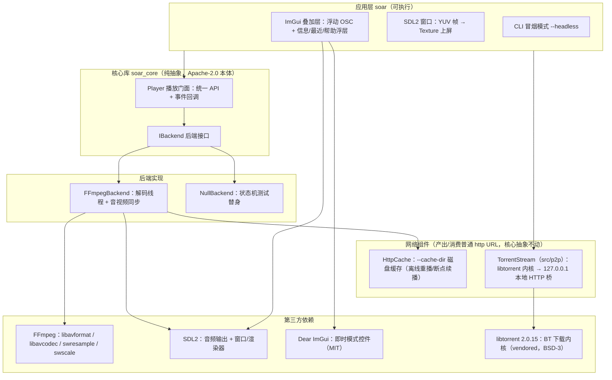

<div align="center">

[English](README.md) | [中文](README.zh.md)


# Soar — Universal Media Player

**万般格式，任其翱翔。**

Soar 是一个基于 FFmpeg + SDL2 的 C++17 开源媒体播放器：封装一套核心播放抽象（Playback Abstraction）与桌面 UI，解码复用 FFmpeg，把"能想到的格式都放得出来"作为长期目标。

[](https://github.com/cuihairu/soar/actions/workflows/ci.yml)
[](https://en.cppreference.com/w/cpp/17)
[](LICENSE)
[](https://github.com/cuihairu/soar/actions/workflows/ci.yml)
[](https://cmake.org)
[](https://ffmpeg.org)
[](https://wiki.libsdl.org)

[文档](https://github.com/cuihairu/soar/tree/main/docs) · [构建指南](docs/build.md) · [路线图](docs/mvp.md)

</div>

## 为什么做 Soar

我们过去在播放器项目里反复踩同样的坑：播放内核和 UI 纠缠不清，依赖许可证（License）把分发卡死，想在移动端复用时才发现核心绑死在某个平台框架上。Soar 把这三条教训写成了设计约束。

播放 API 与事件模型不依赖任何具体多媒体库，UI 换掉、内核不动。后端可插拔：FFmpeg、系统框架、测试用的假后端实现同一个 `IBackend` 接口。项目本体是 Apache-2.0，依赖选型守住 LGPL/GPL 边界（见 [docs/licensing.md](docs/licensing.md)）。

## 当前状态

v0.1 的核心播放链路（打开 → 解码 → 音视频同步 → 渲染/出声）已在 FFmpeg + SDL2 后端跑通，CLI 冒烟入口可用；v0.2 的能力已全部落地（播放列表、截图、A-B 循环、音频端点切换、HLS/DASH/RTSP 冒烟、字幕渲染与字幕体验、边下边看与 P2P 下载，见下文路线图与 [docs/mvp.md](docs/mvp.md)）。桌面端是 SDL2 窗口 + Dear ImGui 叠加的浮动控制栏（OSC），配快捷键与信息/最近/帮助/播放列表浮层（设计与取舍见 [docs/ui-design.md](docs/ui-design.md)）；播放中、暂停中，音频轨与字幕轨都能运行时切换，播放不中断（细节见下文及 docs/mvp.md §6）。v1.0（硬解/HDR、投屏、媒体库）尚未开始。

## 功能特性（当前已实现）

- **媒体输入**：本地文件、多文件入队（`soar <a> <b> …`，首个即播其余排队）、网络流 URL（`http(s)`/HLS/DASH/RTSP 等 FFmpeg 支持的一切协议）、`.torrent` 文件与 `magnet:` 链接；打开失败时错误原因可见；
- **播放控制**：播放 / 暂停 / 停止 / Seek（跳转）/ 倍速（Rate）/ 音量与静音；
- **播放列表**：`N`/`Shift+N` 下一首/上一首（越界只 Toast 不绕回），自然播完自动步进（走到队尾停在 Ended，空格可重播），`P` 浮层点选即播、`x` 删除，Loop 三态（off/all/one）与 Shuffle；
- **截图与 A-B 循环**：`S` 把最近呈现的帧保存为 `screenshot.png`；`L` 三段循环（定 A → 定 B → 清除，到文件尾也回跳，手动 seek 解除）；
- **媒体信息**：时长、是否可 Seek、轨道（Track）列表（视频 / 音频 / 字幕，含编码、语言、标题）；
- **轨道选择**：音频轨运行时切换（播放中/暂停中无感续播）；视频轨切换不支持；字幕轨运行时切换——选中内嵌轨时解码线程在安全点换字幕解码器、cue 从新轨续流（切换点之前的历史 cue 需一次倒退 seek 重扫，无自动重扫），选中外挂轨或关闭时内嵌字幕解码门关闭（细节与边界见 [docs/mvp.md](docs/mvp.md) §6）；
- **字幕渲染**：内嵌 ASS/SSA 经 [libass](https://github.com/libass/libass) 样式渲染（字体/颜色/定位/特效随脚本，容器附件字体即装即用），外挂 .ass/.ssa 同样式渲染、外挂 SRT/WebVTT 按仓库默认样式走同一画布（无 libass 的构建降级为纯文本），内嵌 SRT/WebVTT 文本字幕实时提取显示；`V` 显隐、`[`/`]` ±0.5s 同步偏移、字幕设置浮层（字号/同步偏移/可见性）；可选的字幕下载（`SOAR_SUBTITLE_ENDPOINT`/`_API_KEY`）与字幕翻译（`SOAR_TRANSLATE_ENDPOINT` 等，OpenAI 兼容端点）服务——零默认网络，未配置即不发起任何请求（见 docs/mvp.md §6）；
- **事件驱动**：状态变化、进度更新、媒体信息变化、错误四类事件，UI 只需订阅回调；
- **视频渲染**：后端解码为 YUV420P 帧并导出，应用层用 SDL2 Texture 直接上屏；
- **音频输出**：SDL2 音频设备，重采样（Resample）到设备参数，支持音量/静音/倍速，输出端点可在音轨菜单中枚举与切换（下一个音频帧生效）；
- **网络与下载**：HTTP(S) 顺序播放即边下边看；`--cache-dir=` 磁盘缓存——同一 URL 离线可重播、断点续播、seek 进未下载段只补目标块，`Downloading N%` 进度徽标（http:// 走缓存，https 直通；见 docs/mvp.md §5 P3）；`.torrent`/`magnet:` 经 vendored libtorrent 内核顺序下载、以本地 `http://127.0.0.1:<port>/` 桥进同一播放链路（`--torrent-store=`/`--torrent-peer=`/`--torrent-index=`/`--torrent-list`，窗口期「connecting to swarm - N peers」状态与下载徽标可见；P2P 边界见 docs/mvp.md §5 P4）；
- **桌面 UI**：底部悬浮 OSC（2.5s 无输入自动隐藏，悬停/拖动/浮层/暂停时钉住），整宽 seek 条（悬停时间提示、拖动预览、松手提交）+ 按钮行（传输控制、时钟、音量、倍速、音轨、字幕、全屏）；
- **键鼠交互**：单击切换 OSC、双击全屏、垂直滚轮调音量 / 水平（或 Shift）滚轮 seek、拖放文件打开、最近打开（MRU×15，持久化）；GUI 版（`soarw.exe`/`--gui`）无源启动直接进空主界面——「Open a file」海报，`O` 键或点海报打开文件（Windows 弹文件对话框，其他平台降级为拖放提示 toast）；
- **快捷键**：`Space/K` 播放暂停、`←/→ ±5s`、`Shift+←/→ ±1s`、`PgUp/PgDn ±60s`、`Home`、`0–9` 百分比、`↑/↓` 音量、`M` 静音、`,/.` 倍速、`F` 全屏、`A/C` 循环音轨/字幕、`L` A-B 循环（定 A → 定 B → 清除）、`V` 字幕显隐、`[/]` 字幕前后偏移、`S` 截图（PNG）、`P` 播放队列浮层、`N/Shift+N` 下一首/上一首、`O` 打开文件、`I/R/H` 信息/最近/帮助、`Q` 退出、`Esc` 退全屏或退出；
- **状态提示**：暂停/缓冲指示、OSD Toast 反馈操作结果、媒体信息浮层（含错误行与轨道清单）。

## 架构



设计要点是我们踩坑后的取舍。解封装（Demux）与解码（Decode）放在独立线程，播放线程不被 IO 阻塞，暂停与 Seek 通过条件变量（Condition Variable）和原子量（Atomic）通知解码循环。时钟以 PTS（Presentation Timestamp，显示时间戳）为基准、按播放倍速换算墙钟时间：视频按点到点呈现，音频走设备队列、用背压（Backpressure）限流。测试替身是内置的，`NullBackend` 用纯状态机模拟完整播放行为，不依赖任何多媒体库，核心 API 的单元测试因此能在任何 CI 环境跑起来。

## 一键安装

从每日构建（滚动 nightly Release）安装当前平台的预编译产物；重复执行即升级到最新 nightly。下载不需要任何凭据。

Linux / macOS（bash 或 zsh）:

```bash
curl -fsSL https://raw.githubusercontent.com/cuihairu/soar/main/install.sh | sh
```

Windows（PowerShell）:

```powershell
irm https://raw.githubusercontent.com/cuihairu/soar/main/install.ps1 | iex
```

平台边界：Windows 包随附依赖 DLL、macOS 包随附 `lib/`（FFmpeg 等动态库按 `otool -L` 依赖闭包捆绑、`@loader_path` 改写自包含；SDL2 等 vcpkg 静态构建部分为静态链接）、Linux 包随附捆绑运行时库（`lib/` 目录，SDL2/FFmpeg/libass 等全部自带），三平台均解压即用。Linux 仍有 libc 层面的版本下限：要求 glibc ≥ 2.38 且 libstdc++ ≥ GLIBCXX_3.4.32（Ubuntu 24.04+ / Debian 13+ / Fedora 39+ / Arch 滚动）——更老的系统（如 Ubuntu 22.04、Debian 12）装不上这些符号版本，二进制起不来，这在包内 PLATFORM-NOTES.txt 有如实说明（安装脚本的验证步会把说明打给你看）。

脚本做的事：检测操作系统与 CPU 架构 → 下载对应平台的 zip（`soar-linux-x64.zip` / `soar-linux-arm64.zip` / `soar-macos-arm64.zip` / `soar-windows-x64.zip`）→ 解包安装（Linux/macOS 默认 `~/.local/bin`，Windows 默认 `%LOCALAPPDATA%\Programs\soar`，可用 `SOAR_INSTALL_DIR` 覆盖；Linux 包的 lib/ 捆绑运行时装到同目录，升级整体替换）→ 需要时写 PATH → `soar --version` 验证。目录不在 PATH 上的平台会写一条带注释的 PATH 行进 shell 配置；不想自动改可设 `SOAR_INSTALL_DIR` 为已在 PATH 的目录。

平台覆盖与每日构建矩阵一致：Linux x64/arm64、macOS Apple Silicon、Windows x64。macOS Intel 与 Windows arm64 没有免费的 CI runner，脚本遇到会明确报错（不会装一个跑不起来的包）。另外两条边界：soar 是桌面播放器、无常驻服务形态，脚本不注册系统服务；每日构建未做代码签名，Windows SmartScreen 拦截时选「更多信息 → 仍要运行」，macOS 首次运行前 `xattr -cr`（脚本已代做）。

除脚本使用的便携 zip 外，nightly Release 还提供：Linux 安装包 `soar-linux-<arch>.deb` / `.rpm`（`dpkg -i` / `rpm -ivh` 安装，含 `/opt/soar` + `/usr/bin/soar` + 菜单项与图标，菜单项 `soar --gui` 打开空主界面，MimeType 注册 video/audio/torrent/magnet）；Windows 安装器 `soar-setup-windows-x64.exe`（装目录/开始菜单/桌面快捷方式/卸载器，快捷方式指向 `soarw.exe`——GUI 版入口，双击启动无控制台黑框、无源直接进空主界面，启动失败会弹错误框并写 `%TEMP%\soar-startup-failures.log`；常见媒体扩展注册为「打开方式 → Soar」候选，不抢默认）。Release 附 `SHA256SUMS.txt` 覆盖全部资产。

## 构建

前置：CMake 3.20+、C++17 编译器（GCC / Clang / MSVC，任何支持 C++17 的版本）、Ninja（推荐）、[vcpkg](https://github.com/microsoft/vcpkg)。

```bash
export VCPKG_ROOT=/path/to/vcpkg   # Windows PowerShell: $env:VCPKG_ROOT="C:\path\to\vcpkg"
cmake --preset default && cmake --build --preset default   # Debug
# 或：cmake --preset release && cmake --build --preset release
```

可选能力自动探测：找到 FFmpeg（pkg-config）则启用 FFmpeg 后端，找到 SDL2（≥ 2.0.18）则启用窗口渲染与音频输出；都找不到时仍可构建纯核心 + CLI（Null 后端）。窗口上的控制层是 Dear ImGui（`SOAR_ENABLE_IMGUI`，默认 ON，配置阶段浅克隆到构建目录），拉不到就退化成裸视频窗口；`-DSOAR_ENABLE_IMGUI=OFF` 可完全跳过。细节见 [docs/build.md](docs/build.md)。

## 使用

```bash
# SDL2 窗口播放（默认后端即 FFmpeg——编译包含时；--backend= 可显式指定）
./build/soar <path-or-url>

# 无源启动进空主界面（「Open a file」海报；GUI 版 soarw.exe 双击同此）
./build/soar --gui

# CLI 冒烟测试（不开窗口：打开 → 播放 → Seek → 暂停 → 停止）
./build/soar --headless --backend=ffmpeg <path-or-url>

# 无多媒体依赖的核心行为演示
./build/soar --backend=null <path-or-url>
```

## 路线图

- **v0.1（MVP，已收口）**：播放控制、Seek、倍速、音量、轨道信息与选择、事件与进度回调、桌面 UI（浮动 OSC + 快捷键 + 信息/最近/帮助浮层）——验收清单全数完成（见 [docs/ui-design.md](docs/ui-design.md) §6）；
- **v0.2**：播放列表、截图、A-B 循环、音频设备选择、HLS/DASH/RTSP 冒烟、字幕体验（字体/大小/同步偏移）——均已落地；
- **v1.0**：硬解（Hardware Decoding）与 HDR、投屏（AirPlay/Chromecast/DLNA）、媒体库与刮削、插件体系。

完整边界与"明确不做"清单见 [docs/mvp.md](docs/mvp.md)。

## 测试

测试基于 CTest 运行：

```bash
ctest --preset default
```

各套件的分工：

| 套件 | 覆盖内容 | 依赖 |
|---|---|---|
| `soar_core_tests` | 核心 API 与播放器状态机 | 无，以 `NullBackend` 为测试替身 |
| `soar_backend_tests` | FFmpeg 后端并发行为（线程交接、竞态） | 无 FFmpeg 时构建为空壳并跳过 |
| `soar_backend_media_tests` | FFmpeg 后端真实媒体语义（轨道、seek、EOF、事件） | 需先运行 fixture 脚本 |
| `soar_http_cache_tests` | 磁盘缓存组件与"边下边看"离线重播 | 集成用例需 FFmpeg 与 fixture |
| `soar_subtitle_tests` | 外挂字幕核心：SRT/WebVTT 解析、sidecar 提供器、下载/翻译客户端 | 纯逻辑，无需媒体与网络 |
| `soar_ass_tests` | ASS 渲染器：libass 薄封装、直 alpha 合成、内嵌轨流式喂入 | 无 libass 时构建为空壳并跳过；渲染用仓库内附测试字体 |
| `soar_ui_tests` | 窗口 UI 的纯逻辑（OSC 自动隐藏状态机、最近打开存储、Toast、时间格式化） | 无需显示器 |
| `soar_p2p_tests` | P2P 桥接：TorrentStream 启停契约、本地 HTTP 服务（Range/多文件/超时） | 进程内建种自足（libtorrent 哈希校验预填充），无 swarm；POSIX socket，Windows 跳过 |
| `soar_cli_tests` | `soar` 子进程冒烟（`--headless` 退出码与报错路径） | 仅当应用目标被构建时注册；Xvfb 用例额外需 `SOAR_TEST_X11=1` |

FFmpeg 媒体测试的媒体文件全部由 `scripts/generate_test_media.sh` 现场合成（纯 lavfi，无网络、无外部素材），脚本打印 `KEY=VALUE` 形式的环境变量供测试定位文件：

```bash
export $(bash scripts/generate_test_media.sh build-system/testmedia)
ctest --preset linux-system   # FFmpeg 后端需要系统 FFmpeg 开发库
```

环境变量未设置时相关用例自动跳过，因此没有媒体 fixture 的平台（如 macOS/Windows CI）套件依然全绿。行覆盖率与分支覆盖率由 CI 的 coverage job（gcovr，过滤异常处理边与内联噪声）统计，报告输出到该 job 的 summary，并可在构建产物 `coverage-report` 中下载；该 job 同时是回归门禁——覆盖率跌破锁定阈值（`--fail-under-line` / `--fail-under-branch`）时直接失败。统计口径与未覆盖项的如实定性（版本依赖行为、防御性代码、结构性不可达）见 [docs/coverage-notes.md](docs/coverage-notes.md)。

## 许可与合规

- 项目本体以 [Apache-2.0](LICENSE) 分发；
- FFmpeg 以 LGPL 构建方式动态链接，我们不分发任何 GPL 组件；集成第三方多媒体库的选型原则与 LGPL 合规清单见 [docs/licensing.md](docs/licensing.md)；
- 发行包需附 [THIRD_PARTY_NOTICES.md](THIRD_PARTY_NOTICES.md) 并按其中模板补齐实际捆绑的组件清单。
